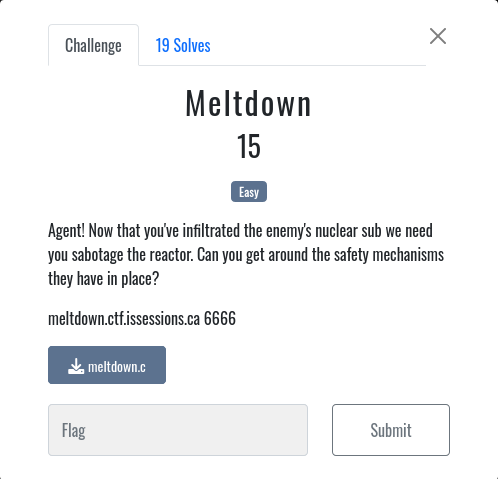

# Meltdown

In the first pwn challenge, we must meltdown a reactor by bypassing its safety mechanism

## Recon

For this challenge we are given a service to connect to running at meltdown.ctf.issessions.ca on port 6666.
Luckily, we are given the source code to the service. Lets see what the service is actually doing.

## Source code review

Opening the meltdown.c file gives us the following

    #include <stdio.h>
    #include <stdlib.h>
    int BUFFER_SIZE = 256;

    int main(){
      char flag[BUFFER_SIZE];
      FILE *flagfp = fopen("./flag.txt", "r");
      fgets(flag, BUFFER_SIZE, flagfp);
      
        printf("Welcome to the reactor's admin interface!\n");
        int done = 0;
        int fTemp = 70;
        char input[BUFFER_SIZE];
        
        while(done == 0){
            int choice;
            int cTemp;
            printf("What temperature would you like to set the reactor to? (Celsius)\n");
            fflush(stdout);
            
            if (fgets(input, BUFFER_SIZE, stdin) == NULL) {
                perror("Error reading input");
                continue;
            }
            if (sscanf(input, "%d", &cTemp) != 1) {
                printf("Invalid input. Please enter a number.\n\n");
                continue;
            }
            
            
            if(cTemp < 500){
                //whose idea was it to take celsius input and then convert to fahrenheit??????????
                fTemp = cTemp * 2 + 32;
                if(fTemp > 2000000000){
                    printf("temperature is %d degress F\n\n", fTemp);
                    printf("AAAAAAAAAAAAAAAAAAAAH TOO HOT!!!!!!\n");
                    puts(flag);
                    done = 1;
                }else{
                    printf("temperature is %d degress F\n\n", fTemp);
                }
                    
                }else{
                    printf("Woah! Too hot, could not change\n\n");
                }
        }
        
        return 0;
    }

So whats this code actually doing?

        while(done == 0){
            int choice;
            int cTemp;
            printf("What temperature would you like to set the reactor to? (Celsius)\n");
            fflush(stdout);
            
            if (fgets(input, BUFFER_SIZE, stdin) == NULL) {
                perror("Error reading input");
                continue;
            }
            if (sscanf(input, "%d", &cTemp) != 1) {
                printf("Invalid input. Please enter a number.\n\n");
                continue;
            }

Here we can see the code takes an integer input and stores it in cTemp.

            if(cTemp < 500){
                //whose idea was it to take celsius input and then convert to fahrenheit??????????
                fTemp = cTemp * 2 + 32;
                if(fTemp > 2000000000){
                    printf("temperature is %d degress F\n\n", fTemp);
                    printf("AAAAAAAAAAAAAAAAAAAAH TOO HOT!!!!!!\n");
                    puts(flag);

It then checks if the value is under 500, and converts the value into its fahrenheit equivalent.

The code then checks if the temperature is over 200000000, and if it is the reactor meltsdown and we get the flag!

But hold on, a value under 500 cant also be over 2000000000, even after the fahrenheit conversion, so how can we get the flag?

The way to get through is to cause an **integer overflow**

In C, `int` data types are alloted 4 bytes of storage, which means the minimum and maximum values that can be stored in them are in the range of -2147483648 to 2147483647. If a value below or above these values is placed in an int data type, it can cause unexpected behaviour where the value stored becomes much larger or much smaller than the value entered.

So to bypass both checks, we have to enter a negative number, so it will be less than 500, but after the fahrenheit conversion integer overflow causes the value to be greater than 2000000000.

Lets use `netcat` to connect to the service on port 6666

    nc meltdown.ctf.issessions.ca 6666

After a bit of trial an error with entering different large negative numbers, we caused the meltdown!

    Welcome to the reactor's admin interface!
    What temperature would you like to set the reactor to? (Celsius)
    -800000000000                     
    temperature is 2022801440 degress F

    AAAAAAAAAAAAAAAAAAAAH TOO HOT!!!!!!
    EspionageCTF{F1r3_Burn1nG}

`flag:EspionageCTF{F1r3_Burn1nG}`

