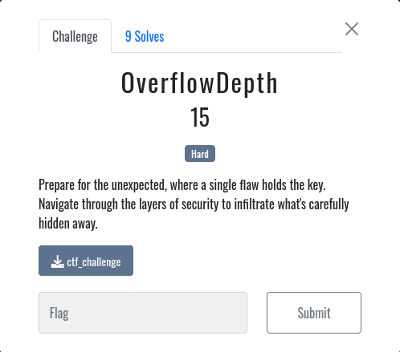
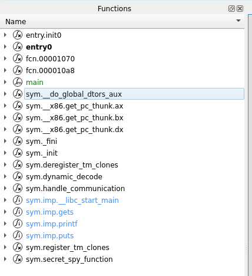
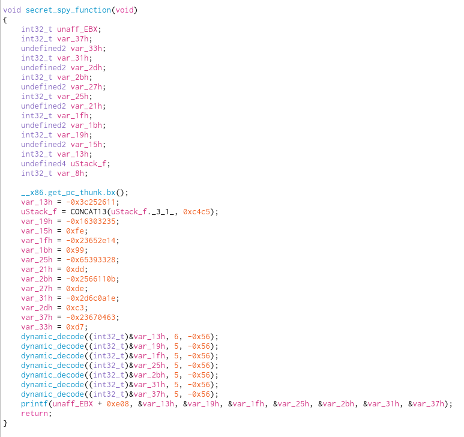
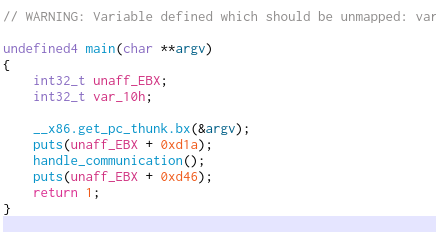

# OverflowDepth

In this challenge, we must find a secret located in an executable file

## Recon

Here we are only given an ELF executable file.

Its always a good habit to run the strings command on executable files to see if the flag is simply stored as a string in the program, lets try it

    ┌──(ben㉿kali)-[~/CTFs/ISS_2023/pwn]
    └─$ strings ctf_challenge 
    /lib/ld-linux.so.2
    _IO_stdin_used
    puts
    gets
    __libc_start_main
    __cxa_finalize
    printf
    libc.so.6
    GLIBC_2.1.3
    GLIBC_2.0
    GLIBC_2.34
    _ITM_deregisterTMCloneTable
    __gmon_start__
    _ITM_registerTMCloneTable
    Access Granted! The secret code is: %s%s%s%s%s%s%s
    Enter your encrypted message: 
    Message received. Verifying...
    Welcome to the Spy Communication Terminal.
    Access Denied! You are not a real spy!
    ;*2$"

Hmm no flag here, we'll have to dig deeper

## Digging Deeper

To explore the ELF further, we'll need to use a disassembler. A disassembler takes and executable file and reconstructs it into its assembly intructions. Ghidra and IDA pro are popular options, but I like to use the Cutter disassembler for CTFs because its simple and lightweight.

Once the executable is opened in Cutter, we get a list of the program functions on the left hand side

At the bottom of the functions list, we can see one called `secret_spy_function`. Now that one seems promising, lets take a look at it

Hm, it doesnt give us the flag, but it does look like it prints it out. Lets see how the program calls this function

Huh, it looks like the program doesn't call the secret spy function. Luckily we can use the gnu Debugger to call it ourselves

## GDB

The gnu Debugger, or gdb, is a command line debugging tool that we can use to analyze and debug our executable

First lets load the executable by running

    gdb ctf_challenge

Next, we set a breakpoint on the main function to pause the program just when it starts

    (gdb) break main

Then we run the program

    (gdb) run

Now with the program paused at the main function, we can manually jump to the secret_spy_function

    (gdb) jump secret_spy_function
    Continuing at 0x565561f8.
    Access Granted! The secret code is: EspionageCTF{0v3rfl0w_D3ptH_9xi7Q2v}

And we get the flag!

`flag:EspionageCTF{0v3rfl0w_D3ptH_9xi7Q2v}`
